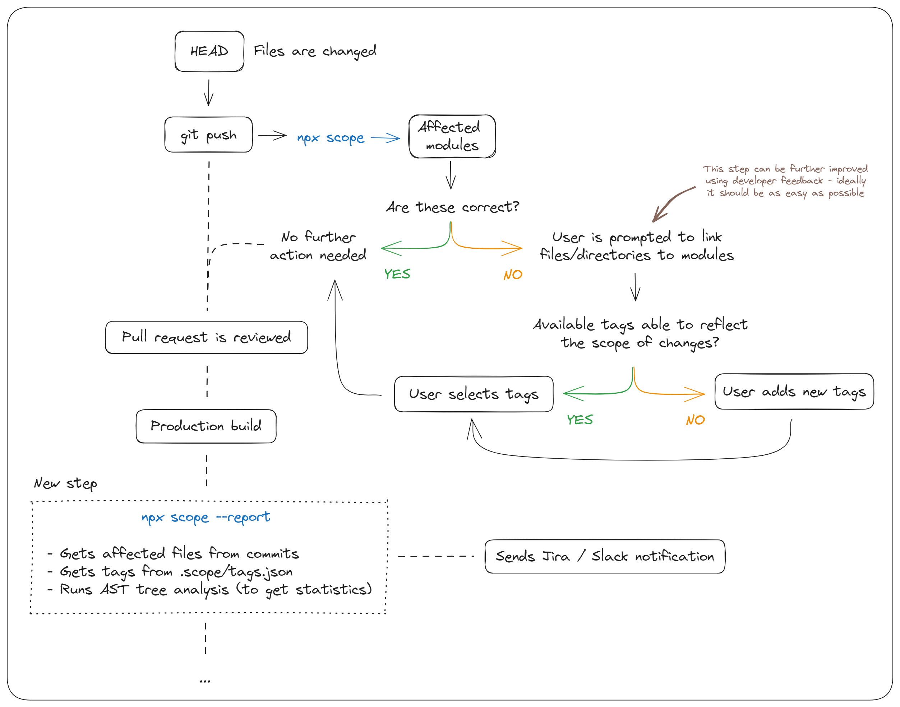

[](https://www.npmjs.com/package/scope-tags)


### How to install

From the repository you want to test the package run

```
npm i scope-tags -D
```

### Configuration

- Option `--report-for-commit-list` is used to update Jira issues, and requires additional metadata in this format:

```
{
    "buildTag": "build-123",
    "commitsAndIssues": [
        {
            "hash": "commit hash in long format",
            "issue": "JIRA-KEY"
        },
        {
            "hash": "commit hash in long format",
            "issue": "JIRA-KEY"
        }
        ...
    ]
}
```

## config.json

- Option `projects.externalImportMap` requires additional metadata in this format:

```
[
    {
        "file": "/path/to/file",
        "imports": [
            "path/to/imported/file"
        ]
    }
]
```
> To use multiple files use a file name with `{x}` specifying current import map chunk.

- Option `gitCommitCountLimit` is a maximum number of commits to search for when doing rev walk on git push hook - used just on the user side while running commands `--verify-unpushed-commits` or `--skip`. It this number is reached you'll get a warning and ignoring it may result in some files being ommited from tag verification.

- Option `logsURL` is used to link to logs directly from generated reports - makes it easier to see all changes which were made to that build. It is optional, if not present the link won't be added to reports. The URL should contain build tag (`"buildTag"` specified in build metadata file) somewhere.

### Local development

1. Clone this repository using `git clone --recurse-submodules https://github.com/matiduda/scope-tags`
2. Make sure you're using the correct verion of Node - `v12.16.1 (npm v6.13.4)`
3. Run `npm install` (preffered Node/NPM version: v12.16.3 / 6.14.4)
4. Run `npm link`
5. Use the local version of the script using `scope` (without the `npx prefix`) (if it doesn't work - restart the terminal)
6. `npx scope` runs version installed in the current repository (as a dependency), `scope` runs locally builded version

To run tests manually use `npm run test`.

### Publishing

For unit testing there is a [separate mock repository](https://www.npmjs.com/package/ora), which should be keeped up-to-date

<!-- To make things easier for developing...  -->

### Features to do

- [-] Use [spinner](https://www.npmjs.com/package/ora) while waiting for async operations (opening repo, ast analysis) - probably not needed because wait time is short
- [-] If eslint available, compare changed files before and after linting. Then, ommit files which only have these changes from scope report - won't be needed because of git option to discard whitespaces and empty lines
- [ ] Add keyboard shortcut hints when selecting tags and files -> https://github.com/enquirer/enquirer#select-choices
- [ ] Add groups on select prompt:
    - [ ] Group files based on common path (files from same directory sould be grouped)
    - [ ] Group tags based on parent modules
- [ ] Add remove hanging tags option to tag manager - search for tags not assigned to any module and ask the user if they want to delete them
- [ ] Unit tests for common actions:
    - [ ] Testing if files are correstly updated in database depending on changes in git
    - [ ] On loading `tags.json` assert that all parents exist in database, if not then these modules won't be displayed
- [ ] Add [automatic publish to npm](https://github.com/marketplace/actions/automated-releases-for-npm-packages) as github action (if tests passed)

### To be discussed

- [ ] Testing approach - how each functionality should be tested?
- [ ] What actions can be performed on files?
    - Adding

### Architecture diagram

